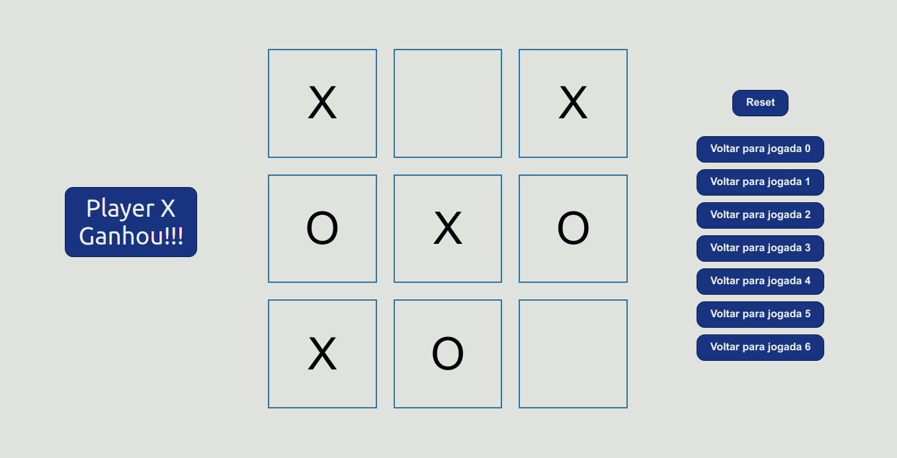

# Jogo da Velha com React

This project was bootstrapped with [Create React App](https://github.com/facebook/create-react-app).

## Exemplo de um jogo:

<h1 align="center">
    
</h1>

### `yarn start`

Runs the app in the development mode.\
Open [http://localhost:3000](http://localhost:3000) to view it in the browser.

The page will reload if you make edits.\
You will also see any lint errors in the console.
